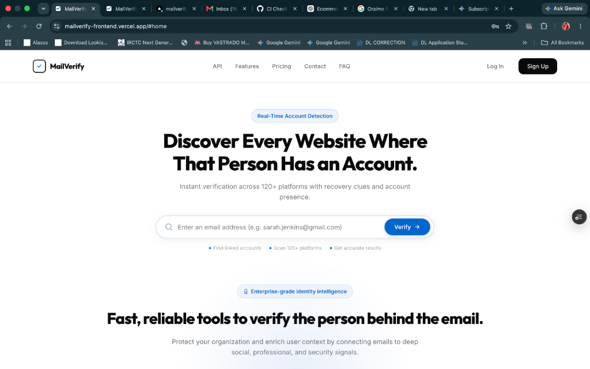
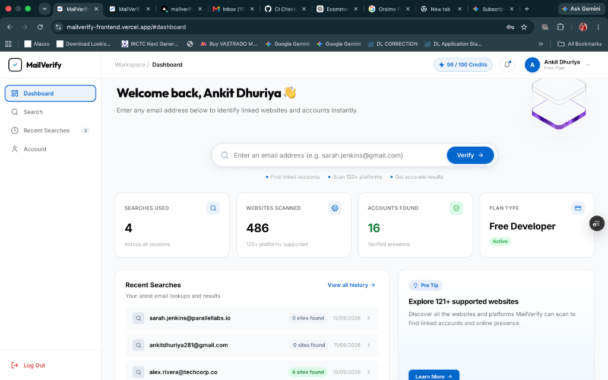
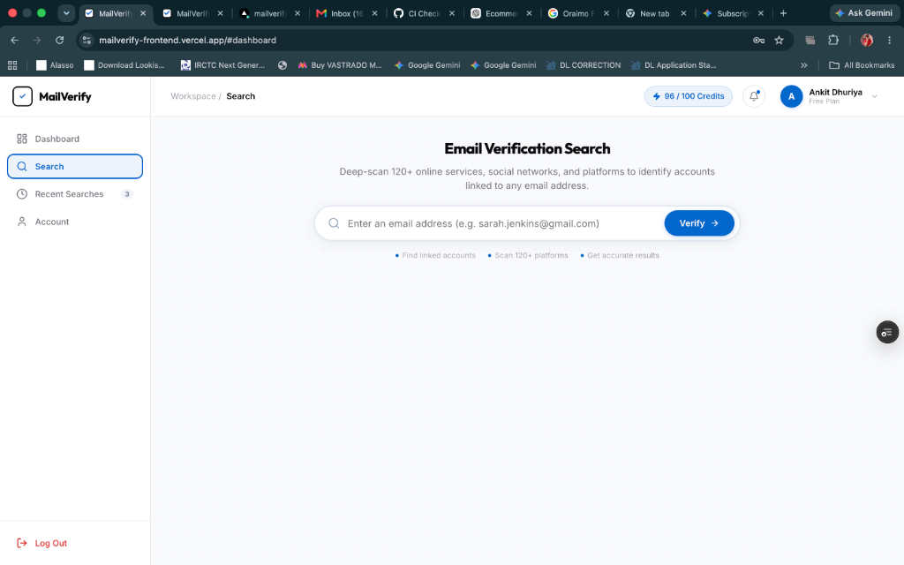
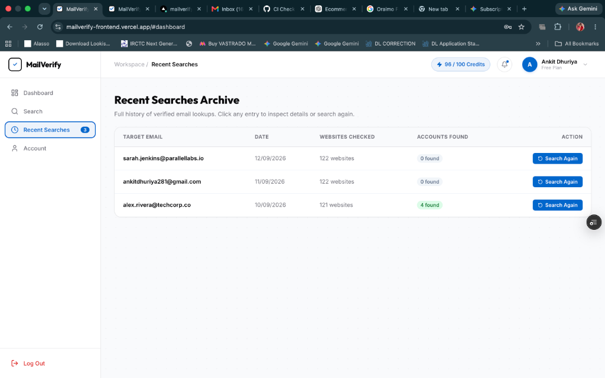
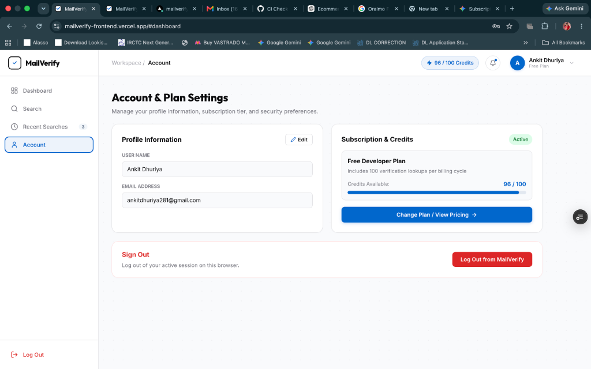

# MailVerify 🔍

> **High-Performance OSINT Email Identity Verification & Digital Footprint Intelligence Platform**

[](https://fastapi.tiangolo.com)
[](https://react.dev)
[](https://www.typescriptlang.org/)
[](https://vitejs.dev/)
[](https://supabase.com)
[](LICENSE)

MailVerify is an end-to-end, full-stack intelligence platform that discovers online accounts associated with an email address across **120+ services** in seconds. Built for cybersecurity professionals, fraud investigators, OSINT researchers, and developer teams.

---

## 📸 Application Screenshots

### 1. Landing & Home Page
Search any email directly with instant public footprint discovery, feature breakdowns, and guest search limits.

<p align="center">
  
</p>

### 2. Authenticated SaaS Dashboard
Real-time credit tracking, scanned website counters, verified account statistics, recent search shortcuts, and plan type status.

<p align="center">
  
</p>

### 3. Email Verification Search
Deep-scan 120+ digital services simultaneously with categorized results, instant response badges, and recovery hint extraction.

<p align="center">
  
</p>

### 4. Recent Searches & History Archive
Full historical search log with timestamped lookups, platform hit counts, and one-click re-search capabilities.

<p align="center">
  
</p>

### 5. Account & Plan Settings
Balanced full-width management interface featuring in-place profile information editing, visual credit quota progress, and session controls.

<p align="center">
  
</p>

---

## ✨ Key Features

- **120+ Platform Coverage**: Concurrent verification across Google, GitHub, Twitter/X, Discord, Spotify, Amazon, Adobe, Instagram, Steam, and over 110 more digital services.
- **Recovery Clues & Hints**: Extracts obscured email hints, linked phone digits, and registration details where exposed by provider password recovery endpoints.
- **Guest Search Protection**: Built-in 2-search rate limiter for unauthenticated visitors prompting seamless Supabase login/signup.
- **Credit Quota Management**: 100 free developer lookup credits per cycle with instant credit deduction and live balance visualizer.
- **Dedicated Pricing & Plans**: Transparent monthly and yearly billing options (`Free`, `Pro`, `Business`) with real-time tier switching and plan state persistence.
- **Editable Profile & User Management**: In-place inline profile editing for display name and email address with instantaneous header avatar synchronization.
- **Search History & Archive**: Search reports automatically saved to user history with full site breakdown and quick re-run capability.

---

## 🛠️ Tech Stack

| Layer | Technology |
|---|---|
| **Frontend** | React 19, TypeScript, Vite, Framer Motion, Lucide Icons |
| **Styling** | Vanilla CSS with custom tokens, responsive grid layouts |
| **Backend** | Python 3.10+, FastAPI, Uvicorn, Holehe OSINT Engine |
| **Concurrency** | Asyncio, HTTPX, Trio asynchronous worker pipelines |
| **Auth & Data** | Supabase Authentication & Session Management, LocalStorage state |

---

## 🚀 Step-by-Step Setup & User Guide

Follow these instructions to run the entire MailVerify platform locally on your machine.

### Prerequisites

Ensure you have the following installed on your system:
- **Node.js** (v18.0 or higher) - [Download Node.js](https://nodejs.org/)
- **Python** (v3.10 or higher) - [Download Python](https://www.python.org/)
- **Git** - [Download Git](https://git-scm.com/)
- *(Optional)* **uv** - Extremely fast Python package manager: `curl -LsSf https://astral.sh/uv/install.sh | sh`

---

### Step 1: Clone the Repository

```bash
git clone https://github.com/DhuriyaAnkit/mailverify.git
cd mailverify
```

---

### Step 2: Backend Setup (FastAPI)

1. Navigate to the backend directory:
   ```bash
   cd backend
   ```

2. Create and activate a Python virtual environment:
   ```bash
   # Using standard venv:
   python3 -m venv .venv
   source .venv/bin/activate   # On Windows: .venv\Scripts\activate

   # Or using uv (recommended):
   uv venv
   source .venv/bin/activate
   ```

3. Install dependencies:
   ```bash
   # Using pip:
   pip install -r requirements.txt

   # Or using uv:
   uv pip install -r requirements.txt
   ```

4. Start the FastAPI server:
   ```bash
   # Standard uvicorn:
   uvicorn app.main:app --reload --port 8000

   # Or with uv:
   uv run uvicorn app.main:app --reload --port 8000
   ```

The backend will be running at: **`http://localhost:8000`**  
Interactive Swagger API documentation is available at: **`http://localhost:8000/docs`**

---

### Step 3: Frontend Setup (React + Vite)

1. Open a new terminal window and navigate to the `frontend` folder:
   ```bash
   cd mailverify/frontend
   ```

2. Install npm packages:
   ```bash
   npm install
   ```

3. Configure Environment Variables:
   Check `frontend/.env.example` and ensure you have `frontend/.env.local` (or `.env`):
   ```env
   VITE_SUPABASE_URL=your_supabase_project_url
   VITE_SUPABASE_ANON_KEY=your_supabase_anon_key
   ```
   *(Note: Default public demo credentials are pre-configured in code for instant testing if `.env` is omitted)*

4. Start the frontend development server:
   ```bash
   npm run dev
   ```

The frontend application will be live at: **`http://localhost:5173`**

---

## 📖 User Workflow Guide

1. **Guest Lookup**:
   - Visit `http://localhost:5173/#home`.
   - Enter an email address in the hero input and click **Verify →**.
   - Guests can run up to 2 searches before being prompted to Log In or Sign Up.
2. **Account Sign In / Registration**:
   - Click **Sign Up** or **Log In** from the top header.
   - Authenticate with your email and password via Supabase.
3. **Dashboard & Live Verification**:
   - Access `http://localhost:5173/#dashboard`.
   - Run email searches across 120+ platforms simultaneously.
   - Inspect detected services, masked phone hints, and recovery emails.
4. **Recent Searches & History**:
   - View your previous searches under the **Recent Searches** tab.
   - Re-run any verification with a single click.
5. **Account & Profile Editing**:
   - Navigate to the **Account** tab in the sidebar.
   - Click the **Edit** button on the **Profile Information** card.
   - Update your display name or email address and click **Save Changes**.
6. **Subscription & Pricing**:
   - Click **Pricing** in the navigation header or **Change Plan / View Pricing →** in the Account tab.
   - Switch between **Monthly** and **Yearly** (Save 20%) billing.
   - Upgrade your tier to unlock higher credit quotas (up to 10,000+ lookups).

---

## 📁 Repository Structure

```
mailverify/
├── backend/
│   ├── app/
│   │   ├── main.py              # FastAPI server & route registration
│   │   ├── holehe_client.py     # Asynchronous Holehe OSINT executor
│   │   └── routers/
│   │       ├── check.py         # /api/check email verification route
│   │       └── health.py        # Health & status endpoints
│   └── requirements.txt         # Backend Python dependencies
├── frontend/
│   ├── public/                  # Favicons and web assets
│   ├── src/
│   │   ├── components/
│   │   │   ├── Header/          # Global navigation header
│   │   │   ├── Footer/          # Application footer
│   │   │   ├── Search/          # Search bar, results & platform cards
│   │   │   ├── Pages/
│   │   │   │   ├── Home/        # Authenticated workspace dashboard
│   │   │   │   ├── Pricing/     # Dedicated Pricing & Plan tiers
│   │   │   │   ├── Coverage/    # 120+ Platform directory
│   │   │   │   ├── Login/       # User login page
│   │   │   │   └── Sign Up/     # User signup page
│   │   │   └── common/          # Modals, toasts, UI helpers
│   │   ├── data/                # Supported platforms dataset
│   │   ├── lib/                 # Supabase client configuration
│   │   ├── App.tsx              # Hash router & authentication state
│   │   └── index.css            # Global CSS design tokens
│   ├── package.json
│   └── vite.config.ts
├── docs/
│   └── screenshots/             # Application UI screenshots
└── README.md
```

---

## 🛡️ Responsible Use & Disclaimer

MailVerify is designed for legitimate cybersecurity defense, OSINT investigations, credential exposure auditing, and authorized security assessments. Always obtain appropriate permission before inspecting third-party email addresses.

---

## 📄 License

This project is licensed under the [MIT License](LICENSE).
